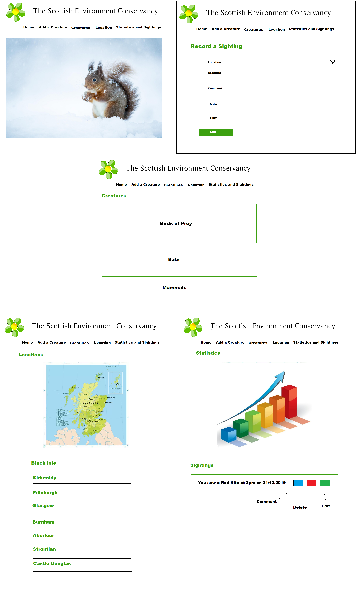
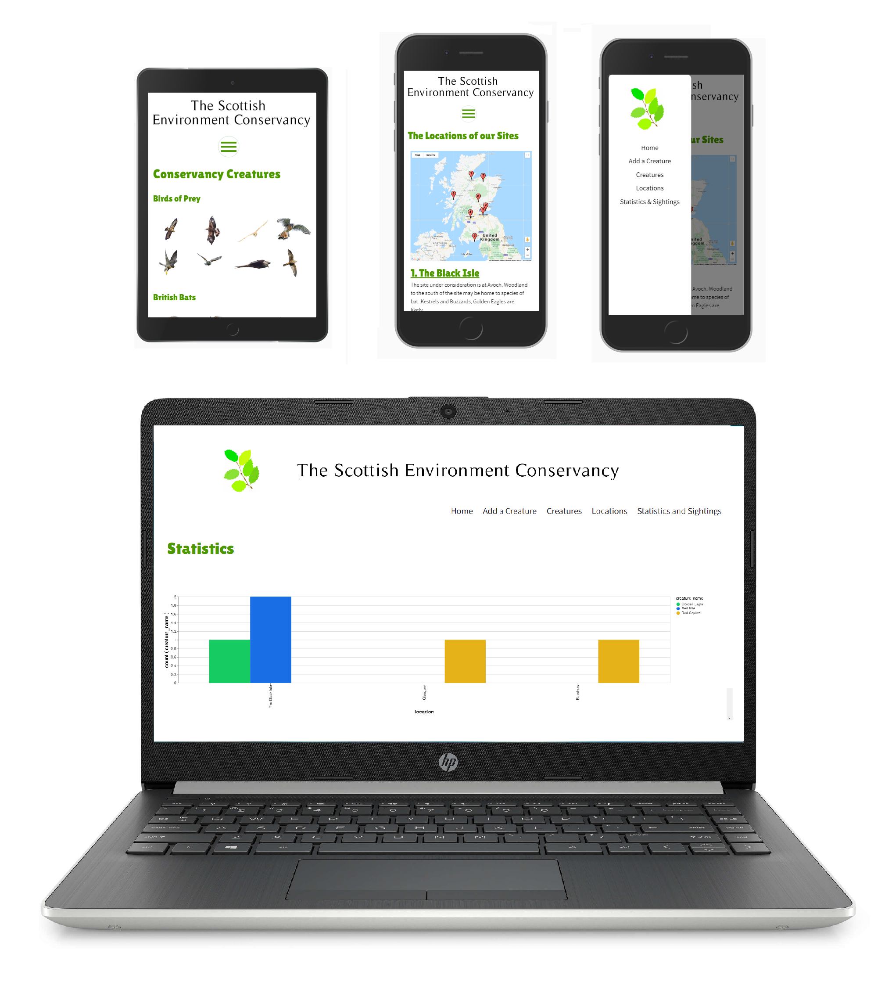

<h1>The Scottish Environment Conservancy</h1>

The Scottish Environment Conservancy is an organization of volunteers who record the populations of certain species of Scottish wildlife 
in areas of the country that have been identified as a possible site for government building projects. The conservancy provides an app to its 
volunteers, preloaded with information about the species and the potential sites and asks users to log any sightings. This data is then used 
by the Scottish government to assess the suitability of the site, as harm to local wildlife populations should be minimized wherever possible.

The purpose of this app is to let users to log sightings, view their data and provide information about locations and creatures, all in 
a user friendly way.

<h2>UX</h2>

The site has a simple, clean, layout with a limited colour-scheme of black and white contrasted with a more vibrant green. The majority of the
screen will be filed with white, drawing the user’s attention to the various elements of the site.

The original design of the site is shown below. The final version is broadly the same although you will notice one or two changes.

The app will be used by volunteers of The Scottish Environment Conservancy, nature enthusiasts who want to ensure a minimum of disruption 
to local wildlife populations caused by building projects. The site’s primary function is allow users to log sightings of creatures to a database.

The page displays sightings by the app’s users in a chart and shows details of individual sightings, which can be edited and deleted if necessary.

<h2>USER STORIES</h2>

Below are a number of scenarios, which demonstrate how a visitor to the site might navigate through the app.

<b>David</b> is visiting the site at the Black Isle and spots a Kestrel hovering above the beach. He navigates to the ‘Add a Creature’ page where he 
completes all of the fields and submits the data to the database by clicking the ‘Record Sightings’ button. This action redirects David to the 
‘Statistics & Sightings’ page, where he can see that the sighting is reflected in the chart and added to the sightings section below.

<b>John</b> intends to travel to Burnham and wants to know the precise location of the entrance to the site. He navigates to the ‘Locations’ page 
and finds the relevant map market for Burnham. By zooming in on the map he can see the exact spot he needs to travel to.

<b>Bob</b> is at the Strontian site when he spots a large bird flying above some distant trees and hears the creature’s call. He wants to know what 
he has seen and whether this is animal is of interest to the project. He navigates to the Creatures page and identifies a possible contender 
from the image in the ‘Birds of Prey’ section. By clicking on the creature he brings up a modal featuring additional information and discovers 
that the call he heard matches this animal. He navigates to the ‘Add a Creature’ page and records the sighting.

<b>Emily</b> records a sighting of a Barn Owl when at the Aberlour site. However she is then able to get a little closer and realises that this is 
in fact a Tawny Owl. She therefore wishes to edit the record to correct her mistake. She navigates to the ‘Statistics and Sightings’ page and 
inds her most recent sighting, which is the one she needs to amend. She clicks edit and is taken to the page that lets her revise the creature she saw.

<b>Lucy</b> is finished at the site in Kirkaldy where she recorded sightings of a number of bats. She wants to see how many of each she saw. By 
navigating to the ‘Statistics and Sightings’ page, she can find this information displayed in the graph.

<b>Morris</b> recorded a sighting of a Mountain hare at the Castle Douglas location. However, he later notices that the thing he thought was a hare 
hasn’t moved and, after getting closer, realises it was a clump of grass. He therefore needs to delete this record from the database. He 
navigates to the ‘Statistics and Sightings’ page, find the records in question and hits delete. The sighting is then struck from the records.

<h2>Features</h2>

<h3>Existing Features</h3>

<ul>

<li><b>Feature 1 (Navbar)</b> - The navbar allows the user to navigate to the various pages that make up the app. It collapses into a ‘burger’ in smaller screen sizes.</li>

<li><b>Feature 2 (Add a Creature form)</b> – The form in the ‘Add a Creature’ page, allows the user to record a sighting. The first field assigns the sighting to one of 
the 8 sites and then the user logs the creature, a comment, the date of the sighting and the time of the sighting.</li>

<li><b>Feature 3 (Creature information)</b> - The ‘creatures’ page provides information on the 16 separate species included in the study. Each creature has its own modal, 
with further information about the animal in question and an additional image.</li>

<li><b>Feature 4 (Google Map)</b> – The Google Map on the ‘Locations’ page shows the locations of each of the 8 sites. The map points to the entrance of the site to allow 
users to find where they are going.</li>

<li><b>Feature 5 (Location details)</b> – Each location has its own modal with further information about the site and an overhead image.</li>

<li><b>Feature 6 (MongoDB Chart)</b> – The data in the Mongo Database is reflected in a chart at the top of the ‘Statistics and Sightings’ page. This chart shows the 
number of each creature spotted at each location.</li>

<li><b>Feature 7 (Sightings List)</b> – Each sighting recorded into the database is reflected in the Sightings section of the ‘Statistics and Sightings’ page. This shows 
the creature spotted and the time and the date of the sighting. A drop down allows the user to view the comment.</li>

<li><b>Feature 8 (Editing function)</b> – From the Sightings section of the ‘Statistics and Sightings’ page, the user can edit any of their records. By clicking on the 
‘Edit’ button they are taken to a form that lets he or she edit that record. By clicking submit, they are returned to the ‘Statistics and Sightings’ page.</li>

<li><b>Feature 9 (Delete function)</b> – From the Sightings section of the ‘Statistics and Sightings’ page, the user can delete any of their records. Clicking on the 
‘Del’ button strikes that entry from the record.</li>

</ul>

<h3>Features Left to Implement</h3>

<ul>

<li>I would like the map markers to be interactive, so that by clicking on the marker, the modal for that location is displayed.</li>

<li>I would like an ‘Are you sure you wish to delete?’ message to be displayed when hitting the delete button to remove a record. 
I attempted to include this by having the ‘Del’ open a modal and then the ‘yes’ button within the modal delete the record, but 
this caused the wrong record to be removed. I wasn’t able to fix this bug.</li>
</ul>

<h2>Technologies Used</h2>

<ul>

<li>JQuery - The project uses JQuery to simplify DOM manipulation. www.jquery.com</li>

<li>Google Fonts – The typeface used throughout the site. www.fonts.google.com</li>

<li>Materialize – A front-end framework used throughout the site. materializecss.com</li>

<li>Google Maps – Used for the ‘Locations’ page. www.developers.google.com/maps</li>

<li>MS Paint – Used to create the original design of the site and adjust some of the images</li>

<li>MongoDB - The database used by the site. www.mongodb.com</li>

<li>Python – Programming language used throughout the site</li>

</ul>

<h2>Testing</h2>

<h3>Navigation Bar</h3>

<ol>
<li>User clicks on the navigation bar item “Add a Creature” and is taken to that page, where they are invited to record a sighting.</li>
<li>User clicks on the navigation bar item “Creatures” and is taken to the page displaying the 16 different species included in the study.</li>
<li>User clicks on the navigation bar item “Locations” and is taken to the page displaying the Google Map and the Location information.</li>
<li>User clicks on the navigation bar item “Statistics and Sightings” and is taken to the page displaying the MondoDB Chart and List of individual records.</li>
<li>In mobile view, the navigation bar shrinks to a burger image. When clicked on, the navigation items are displayed in a Nav bar that slides out from the left of the page.</li>
</ol>

<h3>Recording a Sighting.</h3>

<ol>
<li>User clicks on the ‘Choose Location field which triggers a drop down menu of the 8 sites. The user selects the appropriate location.</li>
<li>User clicks on the ‘Creature’ field and types in the species that they wish to record.</li>
<li>User clicks on the ‘Comment’ field and types in a comment, if they have one.</li>
<li>User clicks on the ‘Date of Sighting’ field and a ‘Date picker’ calendar pops up. The user selects the appropriate date.</li>
<li>User clicks on the ‘Time of Sighting’ field and enters the time they saw the creature.</li>
<li>User clicks the ‘Record Sighting’ button and the sighting is recorded. The user is then redirected to the ‘Statistics and Sightings’ 
page, where they can see that their sighting has been added to the chart and sightings list.</li>
</ol>

<h3>Creatures</h3>

<ol>
<li>User scrolls down to the Small Mammals section of the ‘Creatures’ page.</li>
<li>User hovers mouse over the image of the Red Squirrel and the picture increases in size to indicate that it can be selected.</li>
<li>User clicks on the image and a modal pops up with more information about this species.</li>
<li>User clicks on the cross at the bottom of the modal (or clicks outside the modal) and the window closes.</li>
</ol>

<h3>Locations (Google Map)</h3>

<ol>
<li>User zooms in on the map marker for the site they wish to find. The marker points to the entrance into that site.</li>
</ol>

<h3>Locations (Location Information)</h3>

<ol>
<li>User scrolls down to the Kirkcaldy listing and clicks on the green heading.</li>
<li>This displays a modal showing information about that location. An overhead image is also displayed.</li>
<li>User closes the window by clicking on the cross at the foot of the modal or clicking outside of the box.</li>
</ol>

<h3>Statistics & Sightings (MongoDB Chart)</h3>

<ol>
<li>User clicks on the ‘bar’ in the graph for Red Kites spotted in the Black Isle.</li>
<li>This click causes a box to appear which shows the number of sightings for that particular creature in that location.</li>
</ol>

<h3>Statistics & Sightings (Sightings details)</h3>

<ol>
<li>User finds a sighting record that they wish to view the comments for.</li>
<li>User clicks on the ‘Comments’ button and a section drops down below with the comment that was entered for that particular 
sighting. Clicking on Comments a second time closes the drop down.</li>
</ol>

<h3>Statistics & Sightings (Editing a Record)</h3>

<ol>
<li>User identifies a record that they wish to amend.</li>
<li>User clicks on the ‘Edit’ button and is taken to a form with the same fields as the ‘Add a Creature’ page.</li>
<li>User enters the correct information and hits Record Sighting.</li>
<li>User is returned to the Statistics & Sightings where the record has now been changed.</li>
</ol>

<h3>Statistics & Sightings (Deleting a Record)</h3>

<ol>
<li> User identifies a record that they wish to remove from the database.</li>
<li>Client clicks on the ‘Del’ button to delete the record.</li>
<li>The record is struck from the database and the user remains on the Statistics & Sightings page.</li>
</ol>

<h2>Screens</h2>

<h3>Larger Screens</h3>

<ul>
<li>The banner at the top of the page is wider on this view and features the company’s logo.</li>
<li>The navigation bar displays all of the site’s pages in this view (they are not collapsed).</li>
<li>The modals on the ‘Creatures’ and ‘Locations’ pages have the text on the right and the image on the left in this view.</li>
<li>Certain features on the site (the google map for example) are narrower on larger screens in terms of the % of the width of the screen they take up.</li>
</ul>

<h3>Smaller Screens</h3>

<ul>
<li>The principal difference is that the navigation bar is collapsed into a ‘burger’ on smaller screens and the logo is on the ‘side nav’ rather than in the banner.</li>
<li>Elsewhere, the modals on the ‘Creatures’ and ‘Locations’ pages have the text above the image on this size of display.</li>
</ul>

<h2>Bugs or problems encountered during testing</h2>

<ul>
<li>Images did not display on the ‘Edit a Sighting’ page. This was fixed by….</li>
<li>‘Are you Sure’ modal caused the wrong record to be deleted.</li>
</ul>

<h2>Deployment</h2>

The site has been deployed on Heroku and the code can be viewed on Github.

<h2>Credits</h2>

<h3>Media</h3>

The images of the creatures are from the following sites:

<ul>
<li>woodlandtrust.org.uk</li>
<li>rspb.org.uk</li>
<li>yorkpress.co.uk</li>
<li>nationalgeographic.com</li>
<li>bbc.co.uk</li>
<li>wikipedia.org</li>
</ul>

Creature descriptions are from wikipedia.org

Fonts from font-generator.com

<h3>Acknowledgements</h3>

<ul>
<li>I received inspiration for this project from X</li>
</ul>